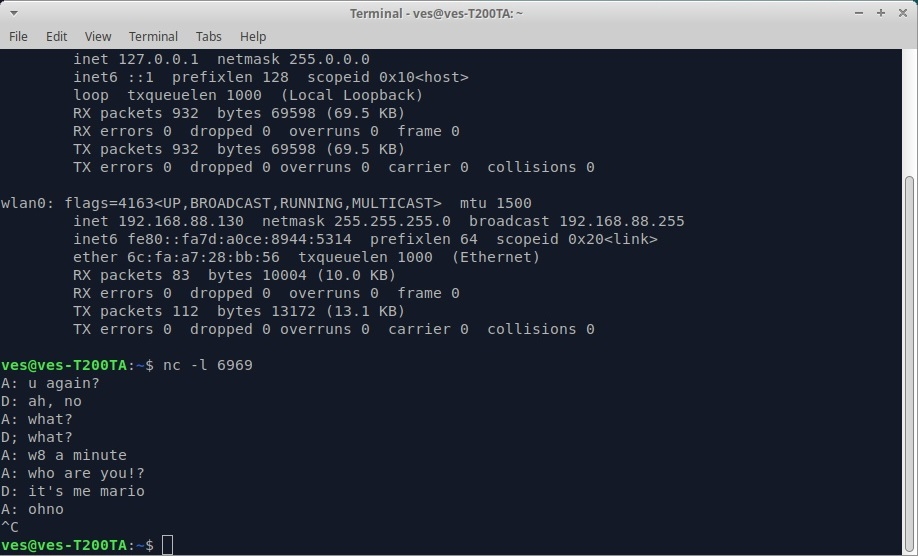

# 10/10 requests and responces

*1) Github.com* Как обычно, методом GET получил начальную страницу. Первое, что бросилось в глаза - в запросе есть хедер `If-None-Matched` с каким-то хэш кодом, начинающимся с комбинацией W/. Поиск по MDN показал, что этот хедер делает запрос условным и используется для кэширования - этот хеш код есть `ETag` - идентификатор для (догадайтесь, чего) идентификации ресурсов. Мол, сервер должен ответить со статусом 200 и отправить ресурс, только если у него не совпадает `ETag`, который был передан в запросе. В ответе гитхаба был хедер `ETag`, который, как я понял, выдал мне `ETag` уже на эту страницу - он не совпадал с `ETag`'ом, который я передал ему. А, ну и еще у меня uBlock блочил кучу POST запросов с какой-то гугловской аналитикой.

*2)steampowered.com* На запрос главной страницы в ответе был хедер `Server`, в котором был указан `nginx`. Огромное количество запросов, почти все - изображение (неудивительно, там на главной столько всего), чуть меньше половины из них у меня уже были в кэше - сервер отвечал статусом 304.

*3)dvfu.ru/schedule* Ну как же без расписания. В глаза бросился новый мне хэдер `Pragma` со значением `no-cache`. Из MDN я выяснил, что это полностью аналогично `Cache-Control: no-cache`, а `Pragma` MDN считает устаревшим и советует использовать его только ради обратной совместимости с HTTP/1.0

*4)habr.com* Статус ответа на запрос главной страницы был 302. Почему - не знаю, вроде как habr давно habr. В ответе показался новый хедер `Public-Key-Pins`, который, как оказалось, устаревший и MDN не советует его использовать в новых сайтах. Возможно, он остался только совместимости ради, а возможно, создатели хабра ленивые люди. Тут, как и в стиме, тоже было много запросов, так как подгружались все картинки-превьюшки статей, а также аватарки некоторых компаний, иконки хабра и иконки соц.сетей. Часть картинок загружалась с кодом 206, что было удивительно. Еще хедер `Server` в ответе на запрос главной страницы имел значение `QRATOR`, на запрос картинок с домена hsto.org - `cloudflare`, а на запрос картинок с домена habrastorage.org (что примечательно, все ответы с этого домена имели статус код 302) - `nginx`.

# social auth
*1) vk.com* Даже не знаю, что сказать. В `POST` запросе был хедер `Server: kittenx`, предостерегаю от гугления. Думаю, это какой-то их собственный форк `nginx`, так как слышал, что они им пользуются (но могу наврать). В следующем `GET` запросе был хэдер `Authorization` с какой-то строкой в кодировке BASE64. Воооот

2)*steampowered.com* Тут интереснее, так как сразу после логина были отправлены 4 `POST` запроса, одним из них был файл `/login/getrsakey` - как видно, стим пользуется алгоритмом RSA. Правда, я не до конца понял, какой битности генерируются ключи.
# telnet dialog

